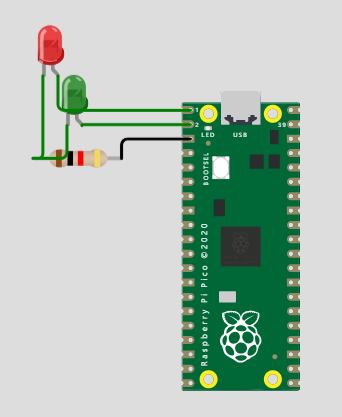
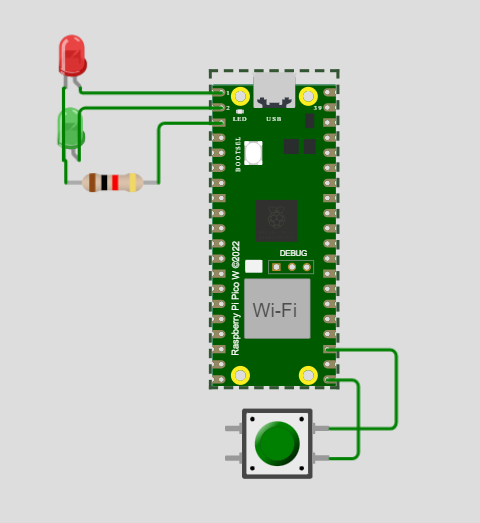
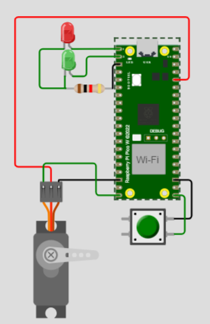
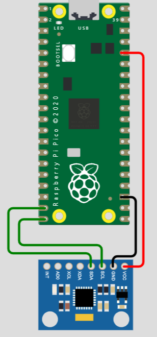

# Engineering_4_Notebook

## Table of Contents
* [Launch_Pad_Part_1](#Launch_Pad_Part_1)
* [Launch_Pad_Part_2](#Launch_Pad_Part_2)
* [Launch_Pad_Part_3](#Launch_Pad_Part_3)
* [Launch_Pad_Part_4](#Launch_Pad_Part_4)

## Launch_Pad_Part_1

### Assignment Description
The purpose of this assignment was to print out a countdown on the serial monitor from 10 - 0. When it reaches 0, it is supposed to print "LIFTOFF."

### Evidence 

### Wiring

There is no wiring because we used the onboard LED.

### Code
[Launchpad_1 Code](https://github.com/ggastin30/Engineering_4_Notebook/blob/main/raspberry-pi/Launchpad_1.py)

### Reflection
This year, I figured out the hard way that F5 is not the standard for running code. Make sure to use CTRL S or D to run the code instead. Also, make sure to put the code into the code.py file from the board because it will not run if you just try to send it from the normal file. A handy tip is if you want to print some words, but then a variable, separate them with a comma inside of the print statement.

## Launch_Pad_Part_2

### Assignment Description
The purpose of this assignment was to flash an LED once every second of the ten-second countdown. Once it reached zero, we flashed a different LED to signal the launch.

### Evidence 

 

### Wiring

### Code

[Launchpad_2 Code](https://github.com/ggastin30/Engineering_4_Notebook/blob/main/raspberry-pi/Launchpad_2.py)

### Reflection
This assignment was pretty basic because we could base most of it on the last assignment so we just had to add an LED flashing when the second changed. I did have a hard time creating a GIF for the evidence. I used ezgif and had to compress it after creating a GIF because it was too big. I also made a big mistake of writing on top of my old code when I did the assignment which cost me lots of valuable time to re-write the old code.

## Launch_Pad_Part_3

### Assignment Description
The purpose of this assignment was to create an easier way to start the countdown by adding a button. When the button is pressed it starts the countdown or restarts it if it is already finished.

### Evidence 

 

### Wiring

### Code

[Launchpad_3 Code](https://github.com/ggastin30/Engineering_4_Notebook/blob/main/raspberry-pi/Launchpad_3.py)

### Reflection
I got a bit confused with all of the if statements that I created. I tried to do an else if but realized that you only need that if you have 3 conditions. Also, make sure to indent the code inside of the if statements, or else it won't be in the loop. Another piece of advice unique to this assignment is that you only need to put a ground and a pin on one side of the button if you pull the pin up.

## Launch_Pad_Part_4

### Assignment Description
This assignment was the end of the launchpad modules so the goal was to have a complete and functioning code for all of the past 3 parts but then also add the servo that moves at the end. The servo should turn 180 degrees when the liftoff happens.

### Evidence 

 

### Wiring

### Code

[Launchpad_4 Code](https://github.com/ggastin30/Engineering_4_Notebook/blob/main/raspberry-pi/Launchpad_4.py)

### Reflection
I didn't have too much trouble with this assignment apart from the library downloads. If you are importing a new library that is not built into the board, you need to take it from the lib folder of the Circuit Python Bundle and put it in the lib on the pico. Another thing that gave me trouble was the servo twitching when it was at 180 degrees. If you just make it 179 degrees instead, it won't twitch at all.

## Crash_Avoidance_1

### Assignment Description

### Evidence 

 

### Wiring

### Code

[Crash_Avoidance_1 Code](https://github.com/ggastin30/Engineering_4_Notebook/blob/main/raspberry-pi/Launchpad_4.py)

### Reflection

## Onshape_Assignment_Template

### Assignment Description

Write your assignment description here. What is the purpose of this assignment? It should be at least a few sentences.

### Part Link 

[Create a link to your Onshape document](https://cvilleschools.onshape.com/documents/003e413cee57f7ccccaa15c2/w/ea71050bb283bf3bf088c96c/e/c85ae532263d3b551e1795d0?renderMode=0&uiState=62d9b9d7883c4f335ec42021). Don't forget to turn on link sharing in your Onshape document so that others can see it. 

### Part Image

Take a nice screenshot of your Onshape document. 

### Reflection

What went wrong / was challenging, how'd you figure it out, and what did you learn from that experience? Your goal for the reflection is to pass on knowledge that will make this assignment better or easier for the next person. Think about your audience for this one, which may be "future you" (when you realize you need some of this code in three months), me, or your college admission committee!

&nbsp;

## Media Test

Your readme will have various images and gifs on it. Upload a test image and test gif to make sure you've got the process figured out. Pick whatever image and gif you want!

### Test Link
 [Hyperlink text](raspberry-pi/test.py)      
### Test Image
 
### Test GIF
 
