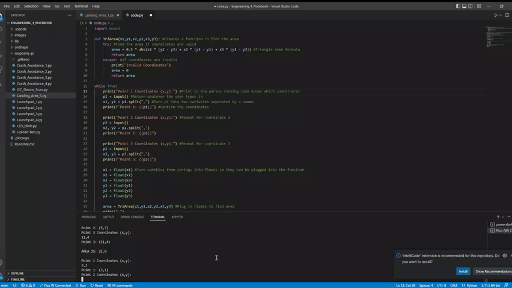
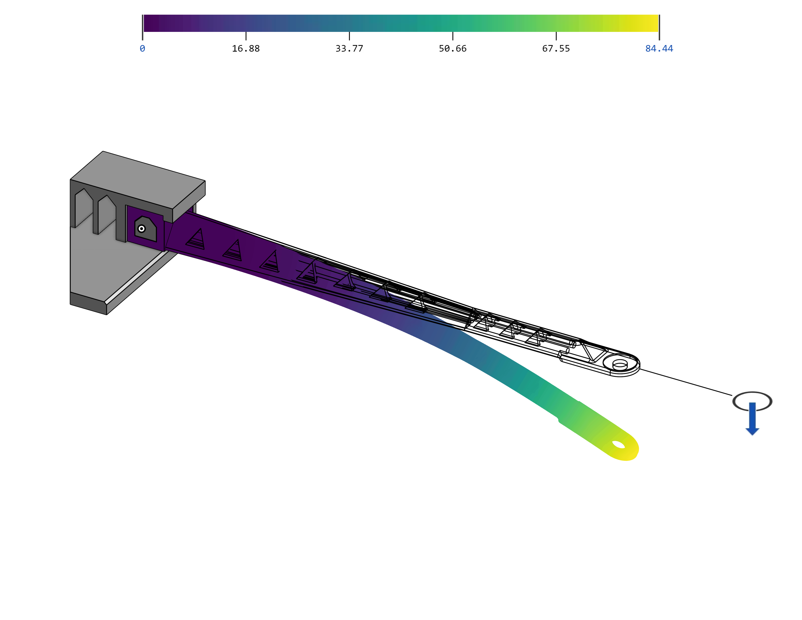

# Engineering_4_Notebook

## Table of Contents
* [Launch_Pad_Part_1](#Launch_Pad_Part_1)
* [Launch_Pad_Part_2](#Launch_Pad_Part_2)
* [Launch_Pad_Part_3](#Launch_Pad_Part_3)
* [Launch_Pad_Part_4](#Launch_Pad_Part_4)
* [Crash_Avoidance_1](#Crash_Avoidance_1)
* [Crash_Avoidance_2](#Crash_Avoidance_2)
* [Crash_Avoidance_3](#Crash_Avoidance_3)
* [Beam_Design](#Beam_Design)
* [Beam_Analysis](#Beam_Analysis)
* [Beam_Final](#Beam_Final)

## Launch_Pad_Part_1

### Assignment Description
The purpose of this assignment was to print out a countdown on the serial monitor from 10 - 0. When it reaches 0, it is supposed to print "LIFTOFF."

### Evidence 

### Wiring

There is no wiring because we used the onboard LED.

### Code
[Launchpad_1 Code](https://github.com/ggastin30/Engineering_4_Notebook/blob/main/raspberry-pi/Launchpad_1.py)

### Reflection
This year, I figured out the hard way that F5 is not the standard for running code. Make sure to use CTRL S or D to run the code instead. Also, make sure to put the code into the code.py file from the board because it will not run if you just try to send it from the normal file. A handy tip is if you want to print some words, but then a variable, separate them with a comma inside of the print statement.

## Launch_Pad_Part_2

### Assignment Description
The purpose of this assignment was to flash an LED once every second of the ten-second countdown. Once it reached zero, we flashed a different LED to signal the launch.

### Evidence 

 

### Wiring

### Code

[Launchpad_2 Code](https://github.com/ggastin30/Engineering_4_Notebook/blob/main/raspberry-pi/Launchpad_2.py)

### Reflection
This assignment was pretty basic because we could base most of it on the last assignment so we just had to add an LED flashing when the second changed. I did have a hard time creating a GIF for the evidence. I used ezgif and had to compress it after creating a GIF because it was too big. I also made a big mistake of writing on top of my old code when I did the assignment which cost me lots of valuable time to re-write the old code.

## Launch_Pad_Part_3

### Assignment Description
The purpose of this assignment was to create an easier way to start the countdown by adding a button. When the button is pressed it starts the countdown or restarts it if it is already finished.

### Evidence 

 

### Wiring

### Code

[Launchpad_3 Code](https://github.com/ggastin30/Engineering_4_Notebook/blob/main/raspberry-pi/Launchpad_3.py)

### Reflection
I got a bit confused with all of the if statements that I created. I tried to do an else if but realized that you only need that if you have 3 conditions. Also, make sure to indent the code inside of the if statements, or else it won't be in the loop. Another piece of advice unique to this assignment is that you only need to put a ground and a pin on one side of the button if you pull the pin-up.

## Launch_Pad_Part_4

### Assignment Description
This assignment was the end of the launchpad modules so the goal was to have a complete and functioning code for all of the past 3 parts but then also add the servo that moves at the end. The servo should turn 180 degrees when the liftoff happens.

### Evidence 

 

### Wiring

### Code

[Launchpad_4 Code](https://github.com/ggastin30/Engineering_4_Notebook/blob/main/raspberry-pi/Launchpad_4.py)

### Reflection
I didn't have too much trouble with this assignment apart from the library downloads. If you are importing a new library that is not built into the board, you need to take it from the lib folder of the Circuit Python Bundle and put it in the lib on the pico. Another thing that gave me trouble was the servo twitching when it was at 180 degrees. If you just make it 179 degrees instead, it won't twitch at all.

## Crash_Avoidance_1

### Assignment Description
The goal of this assignment was to read the acceleration of the MPU6050 in three different axes. This will tell us which way it is going when we try to counteract it in crash avoidance. 

### Evidence 

 

### Wiring

### Code

[Crash_Avoidance_1 Code](https://github.com/ggastin30/Engineering_4_Notebook/blob/main/raspberry-pi/Crash_Avoidance_1.py)

### Reflection
This assignment was a bit tricky because it was hard to tell if I was done or not. I had to play around with the delay on the printing to find an interval that hit most of the movement but wasn't too fast so that the values were blurry. I learned a very useful thing in this assignment about printing that I wish I had known earlier. If you fill the print with (f" {}"), anything in the brackets will be a variable, and anything in the blank space is just printed in text.

## Crash_Avoidance_2

### Assignment Description
This assignment built on the previous one as we had to turn an LED on if the board was tilted at a 90-degree angle. This would detect if a flying object was tilted on its side and crashing.

### Evidence 

 

### Wiring

### Code

[Crash_Avoidance_2 Code](https://github.com/ggastin30/Engineering_4_Notebook/blob/main/raspberry-pi/Crash_Avoidance_2.py)

### Reflection
This assignment taught me some interesting things about acceleration. Gravity affects the acceleration of the MPU with a factor of 9.8 if that axis is perpendicular to the ground. Mobile batteries are very useful and much easier to use when you have something that needs to be tested with some sort of motion. Simply wire the battery holder with a GND to Gnd and the SW to VSYS.

## Crash_Avoidance_3

### Assignment Description
In this assignment, we had to read the angular velocity of an MPU and print it onto an OLED screen. This could be applied to saving a projectile trying to land that may be spinning in a crazy direction. 

### Evidence 

 

### Wiring

### Code

[Crash_Avoidance_3 Code](https://github.com/ggastin30/Engineering_4_Notebook/blob/main/raspberry-pi/Crash_Avoidance_3.py)

### Reflection
This finale of the set of crash avoidance assignments was probably the trickiest one yet. The OLED had lots of weird syntax that had to be done in a certain order. All of the lines except for the "text_area.text = f"ANGULAR VELOCITY: \n X:{} \n Y:{} \n Z:{}" line which goes in the loop. If you put all of the stuff in the loop, it will just continuously print on top of the previous text. Another simple thing that I was confused about was what the angular velocity was for Z. Z describes the velocity of the spin if the board is flat on the table.

## Landing_Area_1

### Assignment Description
The objective of this assignment was to create a code that could take 3 points and find the area in between them. 

### Evidence 

 

### Wiring

N/A

### Code

[Landing_Area_1](https://github.com/ggastin30/Engineering_4_Notebook/blob/main/raspberry-pi/Landing_Area_1.py)

### Reflection

## Beam_Design

### Assignment Description

The purpose of this assignment was to create a beam that can withstand enough weight and no flex or break. There were numerous requirements for this, including but not limited to a length to the hole of 180mm, less than 13 grams in total, and no overhangs.

### Part Link

[Link to document](https://cvilleschools.onshape.com/documents/c407a01931b8eba03dec4159/w/43c6c11648628f76d52336ae/e/85621042ae551a6f13bf6ea8).

### Part Image

  

### Reflection

There were a lot of tricky constraints that made this assignment difficult. The hardest constraint was that we couldn't have an overhang of 45 degrees or more acute. Our first idea was a honeycomb structure but after we saw this constraint, we had to change our design. We tried to use circles but that also got vetoed because of the overhang. In the end, we used triangles which have good structural integrity and no overhangs. We didn't run into any problems with the weight of 13 grams unlike other teams did. We feel like we needed a better system to have both of us working on the document at the same time. Maybe it would have been better if we were side by side instead of across from each other.

## Beam_Analysis

### Assignment Description

The objective of this assignment was to simulate what would happen to our beam under 30N of pressure in an onshape simulation.

### Part Link

[Link to document](https://cvilleschools.onshape.com/documents/c407a01931b8eba03dec4159/w/43c6c11648628f76d52336ae/e/5e86bb4a23adabcf187f2e56).

### Part Image

  

### Reflection

This assignment was straightforward but you could lose a lot of precious time if you clicked on the wrong thing. Before you run the simulation you need to make sure you have a face selected and not a point. If you select a point, your results will be too good to be true. Another thing is being aware of what you're doing when the simulation is running. The simulation takes an insane amount of time but if you click on another tab in onshape, it will reset the entire process. Make sure to set a good amount of time aside to render the effects of weight on your design.

## Beam_Final

### Assignment Description

The purpose of this assignment was to improve our beam based on the results found from FEA (finite element analysis) so as to make it hold more weight than it did in previous simulations. The constraints of this were the same as they were in previous assignments, meaning that all changes had to comply to all of the same rules.

### Part Link

[Link to document](https://cvilleschools.onshape.com/documents/c407a01931b8eba03dec4159/w/43c6c11648628f76d52336ae/e/85621042ae551a6f13bf6ea8).

### Part Image

 

### Reflection

This assignment was the most time-consuming yet, as trying to improve the structural integrity of the beam resulted in a massive increase in weight, surpassing the 13g restriction. To fit this constraint, I had to cut multiple holes which, in turn, decreased the integrity of the beam. This cycle of shortcomings continued again and again until we realized that the biggest fault was right in the middle of the beam. Our solution was to slap on material from other parts of the build onto the middle, thickening the weakest points on the beam, resulting in a dramatic drop in displacement from roughly 85 all the way down to 16 millimeters at 30 N of force.
